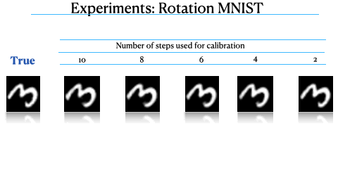

Official repository of the paper (UAI 2021) ["A Variational Approximation for Analyzing the Dynamics of Panel Data"](paper.pdf), Mixed Effect Neural ODE.

Video presentation: [youtube](https://www.youtube.com/watch?v=Nmum5urconQ)

Panel data involving longitudinal measurements of the same set of participants taken over multiple time points is common in studies to understand childhood development and disease modeling. 
We propose a probabilistic model called ME-NODE to incorporate (fixed + random) mixed effects for analyzing the dynamics of panel data.
In the paper, we show that our model can be derived using smooth approximations of SDEs provided by the Wong-Zakai theorem. This allows us to incorporate uncertainty of the trajectory in the modelsimilar to SDE, meanwhile using ODE solvers to fit the model. In addition, we show an interesting connection to the Random projection, which provides theoretical justification of our model's ability to describe dynamics of panel data.


If you like our work, please give us a star. If you use our code in your research projects,
please cite our paper as
```
@inproceedings{nazarovs2021variational,
  title={A variational approximation for analyzing the dynamics of panel data},
  author={Nazarovs, Jurijs and Chakraborty, Rudrasis and Tasneeyapant, Songwong and Ravi, Sathya and Singh, Vikas},
  booktitle={Uncertainty in Artificial Intelligence},
  pages={107--117},
  year={2021},
  organization={PMLR}
}
```

To run the `main.py` file, you need to download [data generator repository](https://github.com/JurijsNazarovs/data_generators), and either
* keep it in a separate directory up-level from the ME-NODE repository or
* put it in the same directory as ME-NODE repository.

Note: the access to the data genration repository is handled in [lib/parse_datasets.py](lib/parse_datasets.py) with `sys.path.append`.

# Visualization of experiments
## Rotating MNIST


## TADPOLE

